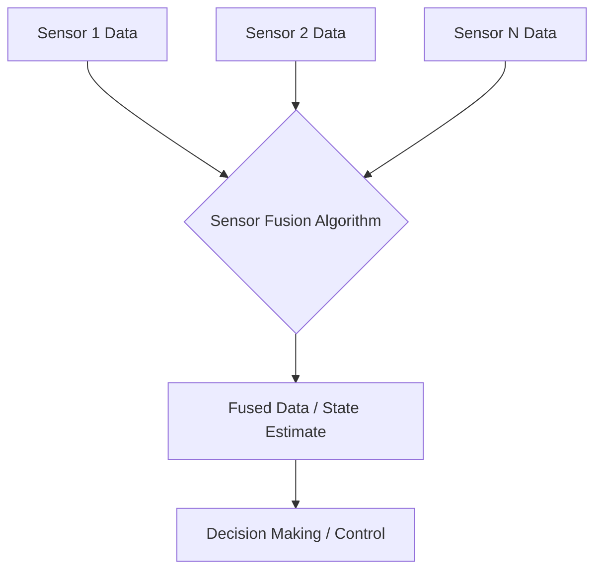

# Advanced Robotics Algorithms

Robots operating in complex environments require sophisticated algorithms for navigation and decision-making. Two critical areas are path planning, which determines the optimal route for a robot, and sensor fusion, which integrates data from multiple sensors for a more robust environmental understanding. These advanced algorithms enable robots to move efficiently, avoid obstacles, and perform tasks with higher accuracy and reliability, moving beyond basic reactive behaviors to more cognitive and adaptive control strategies.

## Path Planning

Path planning is the process of finding a sequence of valid configurations that moves a robot from a start state to a goal state while avoiding obstacles. One of the most common and intuitive algorithms for path planning in grid-based environments is the A* (A-star) search algorithm. A* is an informed search algorithm, meaning it uses a heuristic function to guide its search towards the goal, making it more efficient than uninformed search methods like Breadth-First Search.

### A* Search Algorithm

The A* algorithm works by evaluating each node (grid cell) using a cost function `f(n) = g(n) + h(n)`, where:
- `g(n)` is the cost from the start node to node `n`.
- `h(n)` is the heuristic estimate of the cost from node `n` to the goal node.

A common heuristic for grid maps is the Manhattan distance (sum of absolute differences of coordinates) or Euclidean distance. The algorithm maintains two lists: an "open list" of nodes to be evaluated and a "closed list" of nodes already evaluated.

```python
import heapq

def a_star_search(grid, start, goal):
    rows, cols = len(grid), len(grid[0])
    open_list = []
    heapq.heappush(open_list, (0, start)) # (f_cost, (row, col))

    g_costs = {start: 0}
    parents = {start: None}

    def heuristic(node, goal):
        return abs(node[0] - goal[0]) + abs(node[1] - goal[1]) # Manhattan distance

    while open_list:
        current_f_cost, current_node = heapq.heappop(open_list)

        if current_node == goal:
            path = []
            while current_node is not None:
                path.append(current_node)
                current_node = parents[current_node]
            return path[::-1] # Reverse to get path from start to goal

        for dr, dc in [(0, 1), (0, -1), (1, 0), (-1, 0)]: # 4-directional movement
            neighbor = (current_node[0] + dr, current_node[1] + dc)

            if 0 <= neighbor[0] < rows and 0 <= neighbor[1] < cols and grid[neighbor[0]][neighbor[1]] == 0: # Check bounds and no obstacle
                new_g_cost = g_costs[current_node] + 1 # Cost to move to neighbor is 1

                if neighbor not in g_costs or new_g_cost < g_costs[neighbor]:
                    g_costs[neighbor] = new_g_cost
                    f_cost = new_g_cost + heuristic(neighbor, goal)
                    heapq.heappush(open_list, (f_cost, neighbor))
                    parents[neighbor] = current_node
    return None # No path found

# Example Usage:
# grid = [[0, 0, 0, 0, 0],
#         [0, 1, 0, 1, 0],
#         [0, 0, 0, 0, 0],
#         [0, 1, 0, 1, 0],
#         [0, 0, 0, 0, 0]]
# start_node = (0, 0)
# goal_node = (4, 4)
# path = a_star_search(grid, start_node, goal_node)
# print(f"Path: {path}")
```

## Sensor Fusion

Sensor fusion is the process of combining data from multiple sensors to obtain a more accurate, reliable, and comprehensive understanding of a robot's environment and its own state. Individual sensors often have limitations, such as noise, limited range, or susceptibility to certain environmental conditions. By fusing data, these limitations can be overcome, leading to improved performance. For instance, combining data from a camera (visual information) and a lidar (depth information) can create a richer 3D map of the surroundings, which is vital for obstacle avoidance and navigation.

### Flowchart: Basic Sensor Fusion Process




_Micro Summary: Advanced robotics uses path planning like A* for efficient navigation and sensor fusion to integrate data from multiple sensors, creating robust environmental understanding for intelligent robotic systems._
